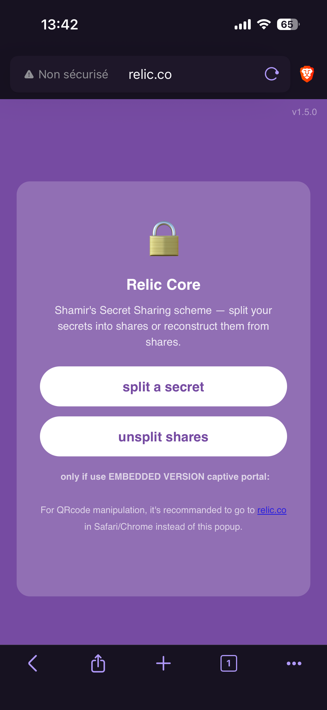
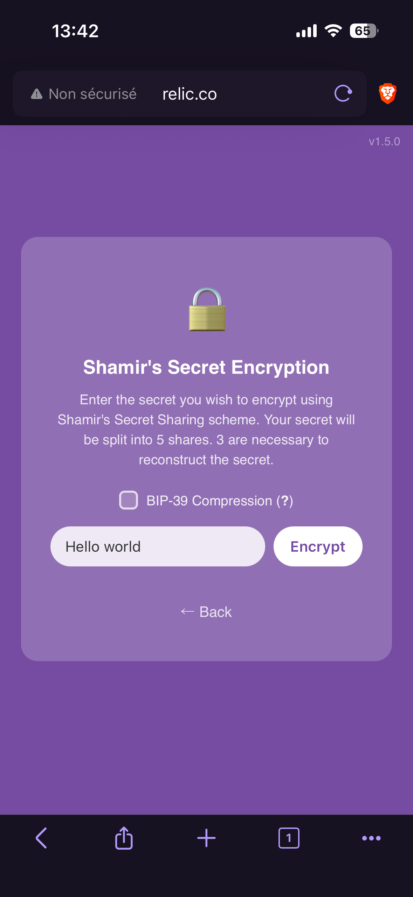

# 2. Create Shares

> Note: If you want to know more about the way to connect to relic device, please refer to the previous page.

When you connect to the Relic, you'll see two options: **split** or **unsplit**.

{ width="300" }

Relic runs as a captive portal, so the app opens automatically on your phone as soon as you connect to the device. To unlock its full capabilities, though, **you should open it in your favourite web browser instead**. As mentioned on the main page of Relic, the link to get there is `relic.co`.

## Split your secret

The **split** option divides your secret into multiple pieces, called *shares*.

Type (or paste) your secret into the text box, then tap the **split** button. The letters and numbers that appear are your shares — save them somewhere safe.

{ width="300" }

## Save your shares

Once your secret is split, you have two ways to save the resulting shares, depending on how you plan to use them.

### Save as text

The simplest option is to save the shares as plain text. Just copy them and store them wherever you keep your sensitive information.

This is a great choice when you want to keep your shares close to you — for example, in a password manager, an encrypted note, or a physical backup you control.

{ width="300" }

### Save as a QR code

Plain text is convenient, but hard to share with other people. That's why you can also download a QR code — a much easier format to share.

The QR code is generated on the fly and never stored on the device. It can be scanned by any phone or tablet, making it perfect for printing out or sending to someone else.

    

> Note: You'll learn about the best ways to distribute your shares in the next step, [Distribute Shares](3_distribute-shares.md).

## Unsplit your shares

The **unsplit** option does the exact opposite: it reconstructs your original secret from your shares. To do so, you'll need to bring together at least the threshold number of shares, as explained in the [recover your secret](5_recover-your-secret.md).

---

> Note: The screenshots in this guide may become outdated over time. They will be refreshed whenever significant updates are made to Relic.
