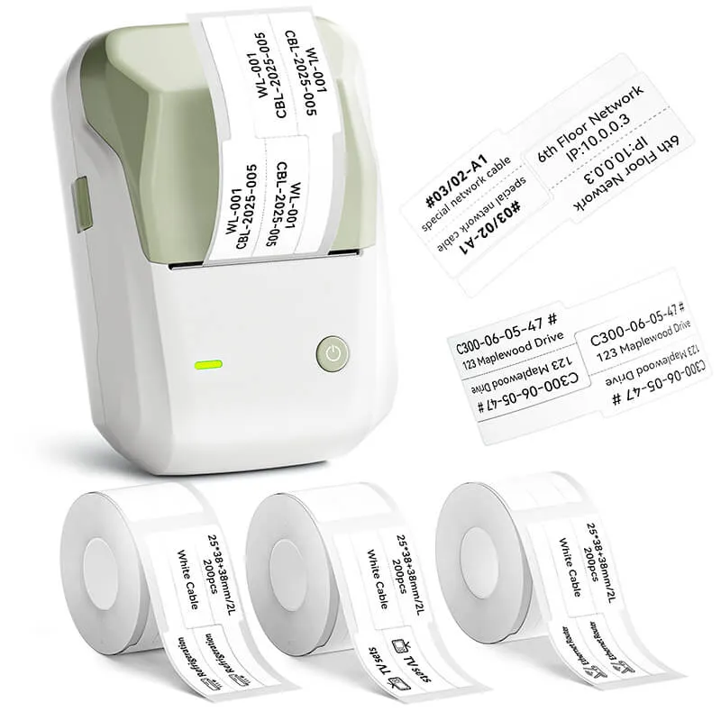
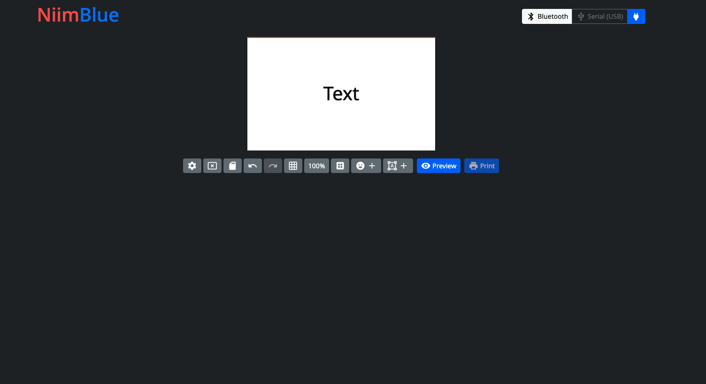
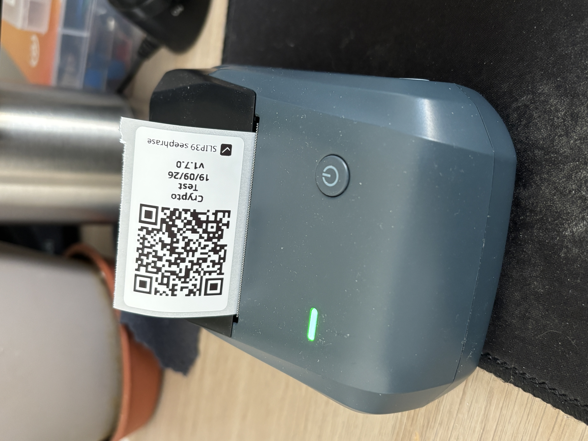

# 3. Distribute Shares

The best way to distribute your shares is to use the QR code format, especially when you have generated a long secret.

To create a share, you have as many options as you can think of. For example, a share can be:

- a printed paper with the QR code
- a paper containing the shares as raw numbers and letters
- a sticker

This document focuses on the best practices for creating a share that respects your full privacy, is easily shared, and stays reliable over time.

## 1. Label your shares

On very important thing that we must first tackle is how to make our share **stay reliable over time**. That's why I'd recommend labeling each share with all the information needed to understand what it is and how to use it — so that if someone finds it 10 years from now, they'll still be able to make sense of it.

The ideal solution is to attach a written note that explains, in plain words, what the share is about. **In practice, though, that's hard to keep on a small object.**

This is why you should also add a short text on the key chain customization that describes what the share is about.

> Note: Keep in mind that such a description is limited by the size of the keychain, so it shouldn't exceed about 20 words.

This means you must embed only the essential information in the label:

- What the secret is about,
- Who the person is that holds this secret,
- When the secret was created,
- Which [relic-core](https://github.com/ficaud/relic-core) version was used at the time.

For example, a label could look like this:

```bash
Bitcoin wallet recovery — belongs to Alice — created on 2026-08-12 — relic-core v1.2.3 — scan the QR code and enter your shares to recover the seed.
```

Or something shorter like:

```bash
BTC-Alice-26/08/12-v1.2.3
```

Now here is an array of acronyms proposition that you could use to describes what the secret is about:

| Name | Acronym |
| --- | --- |
| Gmail | Gm |
| Facebook | Fb |
| 1Password | 1P |
| Trezor Wallet | TW |
| Ledger Wallet | Ldg |
| Bitwarden | Bw |
| Proton mail | Pm |
| Coinbase | Cb |
| Dashlane | Dl |
| Keepass | Kp |
| ... | ... |


## 2. How to distribute shares

Then, I think it's important to discuss the best practice for the distribution of your shares. Here are some rules I'd recommend to follow to keep your secret both safe and robust over time.

### No geographical restrictions

The main rule is that your shares should **not all be stored in the same place**. If you keep them all at home and your house catches fire, you'll lose every share in one go.

In the same way, if you hold valuable assets like cryptocurrency, you'll want to avoid giving potential thieves a single place to break into and find all your shares at once.

### Not too many to your close family

Another rule is that you should **not give your shares to too many people that know each other well.**

This is the same problem as producing them all in the same place: you risk having people join forces against you and use the shares against you.

After all, you can never be sure how your relationships will evolve in the future.

### Don't wait to Recreate the missing shares

As soon as you realize a share is missing among the people keeping them, use Relic again to recreate your secret's shares with the ones that aren't lost at the moment.

**Don't wait until most of them are lost** — by then it will be too late, and your secret will be gone forever.

My personal rule is to keep 2 shares on a threshold of 3, so that I only need one other person to recreate the secret (which is relatively easy to do).

## 3. How to craft a share: the thermal printer method

Finally, here comes the part where we actually create a physical version of our share. You can imagine many ways to do this, but here I'll share a few methods I find reliable, easy, and privacy-friendly.

The main idea is that you shouldn't leave your shares on a computer, but rather turn them into something physical that people can truly own.

## Shopping recommendations

Small thermal printers are cheap, easy to find, and simple to use. They let you print a QR code that you can share and store in a safe place (we'll cover the best practices for storing them later in this guide).

I've personally tried the Niimbot B1 thermal printer, which is a good compromise between price and quality.

{ width="300" }

### Print your shares

Once you have one, you can either use Niimbot's official app or a third-party alternative — the Niimbot API is public, so you can even build your own printing app if you'd like.

I've personally chosen the [Niimblue](https://github.com/MultiMote/niimblue) GitHub project, which you can run locally. I find it a better option if you don't want any of your personal information leaked to the company.

For installation, you can read the project's wiki. I opted for the Docker installation, which fits perfectly into my home-lab setup.

Even though Niimblue is open source, I've also made sure to cut it off from the internet with a specific Docker instruction — you can never be too careful.

Here is my `docker-compose.yml` file:

```bash
services:
  niimblue:
    image: nginx:alpine
    container_name: niimblue
    cap_add:
      - NET_ADMIN
    volumes:
      - ./html:/usr/share/nginx/html
      - ./niimblue-ssl.conf:/etc/nginx/conf.d/default.conf
      - ./cert.pem:/etc/nginx/ssl/cert.pem
      - ./key.pem:/etc/nginx/ssl/key.pem
    ports:
      - "8443:443"
    command: >
      sh -c "apk add --no-cache iptables >/dev/null 2>&1 &&
             iptables -F &&
             iptables -A OUTPUT -m state --state ESTABLISHED,RELATED -j ACCEPT &&
             iptables -A OUTPUT -o lo -j ACCEPT &&
             iptables -P OUTPUT DROP &&
             nginx -g 'daemon off;'"
```

Once the Docker container is running, you can access Relic at `http://localhost:8443/`.

Then all you need to do is create your label and print the QR codes associated with your shares — easy.



Here is what it looks like :

{ width="300" }
