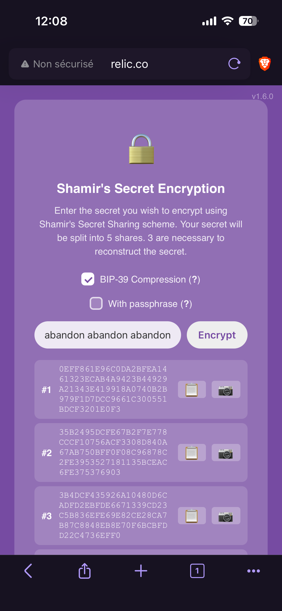
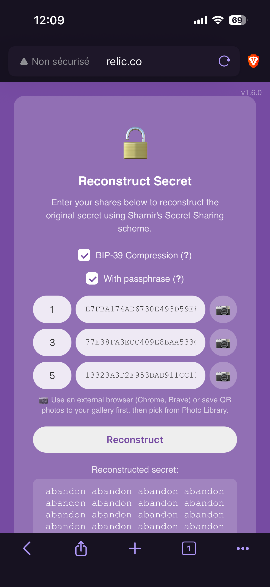

# Seed phrase

Bitcoin wallet recovery often uses the BIP-39 seed phrase to recover the private key. Relic-core provides a way to compress that seed phrase so that the resulting shares are not extended (which would make them harder to share).

## BIP-39 word list

A word before explaining how the compression works...

BIP-39 provides a list of words that can be used to generate a seed phrase. All seed phrases generated for Bitcoin (but also for many other services) are made up of words drawn from this list.

Relic knows the list and can compress the seed phrase using the index of each word in the list rather than the entire word itself.

That means you can choose to activate BIP-39 compression when splitting your shares, **which implies the uncompression will have to be activated for the unsplit process.**

Important consideration: The device only performs the transcription when you encrypt your secret and doesn't not store the seed phrase in its memory.

## How to split with BIP-39 compression

As explained in the [create shares](2_create-shares.md) page, you can split your secret by entering it manually.

All you have to do to activate the compression is check the `BIP-39 compression` box before tapping on "Encrypt".

{ width="300" }

From there, the process is the same. Shares are generated and you can distribute them as you want (except that you benefit from shorter pieces of your secret).

### Adding a pass phrase

If you're using a passphrase with a hidden wallet, you can also check the box `With passphrase` before tapping "Encrypt".

This will compress the seed phrase using the index of each word but leave the passphrase untouched.

**Important note**: The format used to include the passphrase in the seed phrase is as follows:

```bash
"abandon abandon zoo; passphrase"
```

You need to separate the seed phrase from the passphrase with a semicolon (`;`).

## How to recover your secret with BIP-39 compression

As explained in the [recovery secret](4_recover-your-secret.md) page, you can recover your secret by entering the shares manually or by scanning their corresponding QR codes.

All you have to do to activate the compression is check the `BIP-39 compression` box before tapping on "Reconstruct".

{ width="300" }

### Adding a pass phrase

If you know the secret you're trying to recover is a BIP-39 seed phrase that includes a passphrase, all you need to do is check the `With passphrase` box and scan your QR codes (or enter the shares manually) before hitting the `Reconstruct` button.
